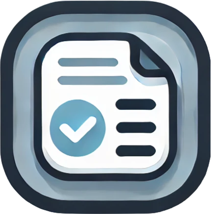
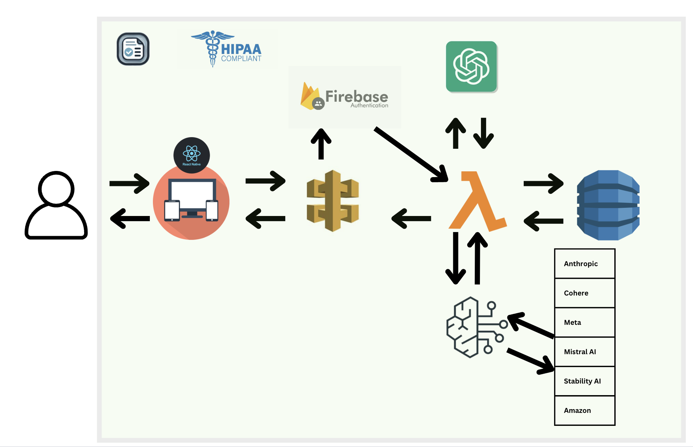

<div align="center">
  <h1>Fills.Ai</h1>
  
</div>


## 🔍 Overview

> Fills.ai is a simple and fast AI healthcare documentation tool for medical assistants, patients, specialists and healthcare providers saving 60% of their documentation time. 

> To learn more about this project business usecase please click on [fills.ai](https://fills.ai/)


# Table of Contents
- [Table of Contents](#table-of-contents)
  - [✨ Features](#-features)
  - [🚀 Tech Stack](#-tech-stack)
- [V 1.0.0 :](#v-100-)
  - [🤝 Getting Started (Prerequisites)](#-getting-started-prerequisites)
    - [Installation](#installation)
  - [🏗 Architecture](#-architecture)
      - [API Gateway Endpoints](#api-gateway-endpoints)
      - [Lambda Functions](#lambda-functions)
      - [AI Integration](#ai-integration)
      - [Database](#database)
  - [Demo](#demo)
  - [🔒 Security](#-security)
    - [Authentication \& Authorization](#authentication--authorization)
    - [Data Protection](#data-protection)
    - [API Security](#api-security)
    - [Compliance](#compliance)
  - [📄 License for FillsApp V 1.0.0](#-license-for-fillsapp-v-100)
  - [💬 Support \& Contact](#-support--contact)

  

## ✨ Features

<div align="center">

[](https://www.hhs.gov/hipaa/index.html)
[](#)
[](#)
[](#)

[](#)
[](#)

</div>

- 📱 **Cross-Platform** - iOS (mobile, IPad), Android, and Web support
- 🎙️ **Voice Model** - Custom trained Medical NLP model for accurate prediction. 
- 📑 **EPIC EHR Integration** - SOAP Notes, Medical Forms, Complex tables, etc just with voice.
- 🤖 **AI-Powered Form Automation** - accurate form filling with any choice of llm
- ⚡ **Real-time Processing** - Instant form filling, validating and processing
  

## 🚀 Tech Stack

<div align="center">

[](https://reactnative.dev/)
[](https://svelte.dev/)
[](https://aws.amazon.com/dynamodb/)
[](https://openai.com/)
[](https://langchain.com/)
[](https://cloud.google.com/)
[](https://cloud.google.com/speech-to-text)
[](https://elevenlabs.io/)
[](https://aws.amazon.com/transcribe/medical/)
[](https://langflow.org/)
[](https://langgraph.com/)
[](https://crew.ai/)
[](https://cloud.google.com/identity)
  [](https://expo.dev/)
  [](https://firebase.google.com/)
  [](https://www.typescriptlang.org/)
  [](https://aws.amazon.com/)
[](https://aws.amazon.com/lambda/)
[](https://aws.amazon.com/api-gateway/)
[](https://aws.amazon.com/bedrock/)
[](https://aws.amazon.com/transcribe/)
</div>

# V 1.0.0 : 
> This app is built with React Native, AWS Bedrock, Lambda, Dynaomodb and various other cutting edge technologies. 

> This application is therefore availabe on web, andrioid , IOS platfroms. Thanks to ReactNative, AWS, GCP.
> 
## 🤝 Getting Started (Prerequisites)

1. **Development Environment**:
   - Node.js
   - npm or yarn package manager
   - Expo CLI (`expo-cli`)

2. **Mobile Development Tools**:
   - For iOS development:
     - macOS computer
     - Xcode (latest version recommended)
     - iOS Simulator or physical iOS device
   
   - For Android development:
     - Android Studio
     - Android SDK
     - Android Emulator or physical Android device

3. **Firebase Setup**:
   - Firebase account
   - Firebase project
   - Firebase configuration (the app uses Firebase Authentication)

4. **AWS Setup**:
   - AWS account
   - API Gateway endpoints (REST APIs, Websocket API) configured (as shown in `aws-config.js`)
   - SAM (IaC) Template will be provided very soon, right now all Temp API keys are availabe in the code, just follow the installation procedure.

5. **Key Dependencies** :
   - React Native (0.74.5)
   - Expo (^51.0.38)
   - React Navigation (^6.0.2)
   - Firebase (^11.0.1)
   - Various Expo packages for:
     - Audio handling (expo-av ~14.0.7)
     - Voice recognition (@react-native-voice/voice ^3.2.4)
     - File system operations (expo-modules-core ~1.12.26)
     - PDF generation (expo-print ~13.0.1, react-native-html-to-pdf ^0.12.0)
     - Gesture handling (react-native-gesture-handler ~2.16.1)

6. **Development Environment Variables**:
   - Firebase configuration
   - AWS API endpoints configuration

7. **Device Permissions**:
   The app requires several device permissions for:
   - Microphone access (for voice recording)
   - File system access (for PDF generation)
   - Camera (if using QR code scanning features)


### Installation
```bash
# Clone the repository
git clone https://github.com/mhhnn/FillsApp.git

# Navigate to project directory
cd FillsApp

# Install dependencies
pnpm i

# Start the app on ios
npx expo run:ios

# Start the app on android
npx expo run:andriod
```


## 🏗 Architecture

<div align="center">
  
  <br/>
  
</div>


#### API Gateway Endpoints
- **HTTP API**: Form submission and retrieval
- **REST API**: Template management
- **WebSocket**: Chatbox 


#### Lambda Functions
- CRUD operations for all forms, Templates.
- Firebase Authorizer authentication verification

#### AI Integration
- **Amazon Bedrock**: chatbot 
- **Amazon Transcribe**: Voice-to-text conversion


#### Database
- **DynamoDB**: Primary data storage
  - Forms table
  - Templates table
  - User profile


## Demo
<div align="center">
  
</div>


## 🔒 Security

### Authentication & Authorization
- Firebase Authentication for secure user management
- JWT token-based API authentication
- Automatic session management and token refresh
- Role-based access control

### Data Protection
- End-to-end encryption for all medical data
- Secure data storage using AWS Dynomo DB.
- HTTPS/TLS encryption for all API communications
- Automatic data sanitization and validation

### API Security
- Rate limiting to prevent abuse
- Input validation and sanitization
- CORS protection
- API key rotation and management

### Compliance
- HIPAA-compliant data handling


## 📄 License for FillsApp V 1.0.0

Copyright 2024 MIT

Permission is hereby granted, free of charge, to any person obtaining a copy of this software and associated documentation files (the "Software"), to deal in the Software without restriction, including without limitation the rights to use, copy, modify, merge, publish, distribute, sublicense, and/or sell copies of the Software, and to permit persons to whom the Software is furnished to do so, subject to the following conditions:

The above copyright notice and this permission notice shall be included in all copies or substantial portions of the Software.

THE SOFTWARE IS PROVIDED "AS IS", WITHOUT WARRANTY OF ANY KIND, EXPRESS OR IMPLIED, INCLUDING BUT NOT LIMITED TO THE WARRANTIES OF MERCHANTABILITY, FITNESS FOR A PARTICULAR PURPOSE AND NONINFRINGEMENT. IN NO EVENT SHALL THE AUTHORS OR COPYRIGHT HOLDERS BE LIABLE FOR ANY CLAIM, DAMAGES OR OTHER LIABILITY, WHETHER IN AN ACTION OF CONTRACT, TORT OR OTHERWISE, ARISING FROM, OUT OF OR IN CONNECTION WITH THE SOFTWARE OR THE USE OR OTHER DEALINGS IN THE SOFTWARE.


## 💬 Support & Contact

<div align="center">

[](mailto:ceo@fills.ai)
</div>

  - website: [fills.ai](https://docs.fillsapp.com)
  - Email: ceo@fills.ai


<div align="center">
  <sub>Built with passion and ❤️ by M Hari Hara Nithin Reddy</sub>
  <br/>
  <sub>© 2024 Fills Ai LLC. All rights reserved.</sub>
</div>
